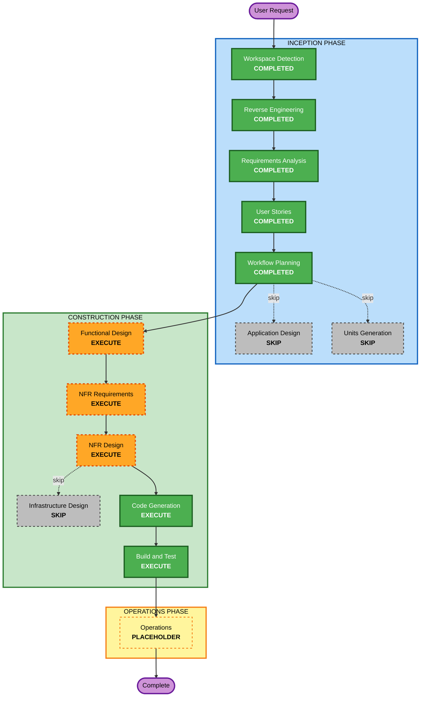

# Execution Plan — Update Student Endpoint

## Detailed Analysis Summary

### Transformation Scope (Brownfield)
- **Transformation Type**: Single-component change — purely additive, no existing code modified
- **Primary Changes**: New handler method, new DTO, one new route registration
- **Files Affected**: `internal/models/student.go`, `internal/handlers/students.go`, `internal/server/server.go`, `internal/handlers/students_test.go`

### Change Impact Assessment

| Area | Impact | Description |
|------|--------|-------------|
| User-facing changes | Yes | New API endpoint available to consumers |
| Structural changes | No | Same package structure, no new packages |
| Data model changes | Minor | New `UpdateStudentRequest` DTO added to existing models file |
| API changes | Yes | New `PUT /api/v1/students/:id` endpoint added |
| NFR impact | Yes | Input validation (SECURITY-05), partial update idempotence (PBT-04), error safety (SECURITY-09) |

### Component Relationships (Brownfield)

```
Primary Component:   internal/handlers  (StudentHandler.UpdateStudent added)
Model Component:     internal/models    (UpdateStudentRequest DTO added)
Router Component:    internal/server    (PUT route registration added)
Test Component:      internal/handlers  (students_test.go extended with 6 new tests)

No new packages. No infrastructure changes. No shared client changes.
```

### Risk Assessment
- **Risk Level**: Low
- **Rollback Complexity**: Easy — fully additive; removing the 3 changed files/additions restores original state
- **Testing Complexity**: Simple — same mock-based unit test pattern as existing tests

---

## Workflow Visualization



### Text Alternative

```
INCEPTION PHASE (all complete)
  [x] Workspace Detection      - COMPLETED
  [x] Reverse Engineering      - COMPLETED
  [x] Requirements Analysis    - COMPLETED
  [x] User Stories             - COMPLETED
  [x] Workflow Planning        - COMPLETED
  [-] Application Design       - SKIP
  [-] Units Generation         - SKIP

CONSTRUCTION PHASE
  [ ] Functional Design        - EXECUTE
  [ ] NFR Requirements         - EXECUTE
  [ ] NFR Design               - EXECUTE
  [-] Infrastructure Design    - SKIP
  [ ] Code Generation          - EXECUTE (always)
  [ ] Build and Test           - EXECUTE (always)

OPERATIONS PHASE
  [-] Operations               - PLACEHOLDER
```

---

## Phases to Execute

### 🔵 INCEPTION PHASE
- [x] Workspace Detection — COMPLETED
- [x] Reverse Engineering — COMPLETED (re-run after tests added)
- [x] Requirements Analysis — COMPLETED
- [x] User Stories — COMPLETED
- [x] Workflow Planning — IN PROGRESS
- [-] Application Design — **SKIP**: No new components or services; all changes within existing `StudentHandler` and `models` package boundaries
- [-] Units Generation — **SKIP**: Single unit of work (one endpoint); decomposition adds no value

### 🟢 CONSTRUCTION PHASE
- [ ] Functional Design — **EXECUTE**: Partial update business logic needs explicit design; PBT-01 requires testable properties to be documented here (idempotence, field-invariant, round-trip)
- [ ] NFR Requirements — **EXECUTE**: Security extension (SECURITY-05, SECURITY-09) and PBT extension (PBT-09 framework selection: `pgregory.net/rapid`) must be formally assessed
- [ ] NFR Design — **EXECUTE**: NFR Requirements executing → NFR Design executes; security patterns incorporated into handler design
- [-] Infrastructure Design — **SKIP**: No infrastructure changes; purely application-layer addition
- [ ] Code Generation — **EXECUTE** (always): Implementation of handler, DTO, route, and tests
- [ ] Build and Test — **EXECUTE** (always): Build verification and test execution instructions

### 🟡 OPERATIONS PHASE
- [-] Operations — PLACEHOLDER (future expansion)

---

## Package Change Sequence

Single-unit change — no inter-package sequencing needed. All changes are within the `school-api` module.

| Order | File | Change Type | Reason |
|-------|------|-------------|--------|
| 1 | `internal/models/student.go` | Add `UpdateStudentRequest` DTO | Model first — handler depends on it |
| 2 | `internal/handlers/students.go` | Add `UpdateStudent` handler method | Handler second — route depends on it |
| 3 | `internal/server/server.go` | Register `PUT /:id` route | Route last — wires handler into router |
| 4 | `internal/handlers/students_test.go` | Add 6 unit tests + extend `newTestRouter` | Tests alongside implementation |

---

## Success Criteria
- **Primary Goal**: `PUT /api/v1/students/:id` endpoint implemented with partial update semantics
- **Key Deliverables**: Handler method, DTO, route registration, 6 unit tests, PBT tests
- **Quality Gates**:
  - All 6 new unit tests pass (`go test ./internal/handlers/...`)
  - All existing tests continue to pass (no regressions)
  - PBT tests pass with seed logging (`go test -v ./...`)
  - No security findings from SECURITY-05, SECURITY-09, SECURITY-03 rules
  - `go build ./...` succeeds
